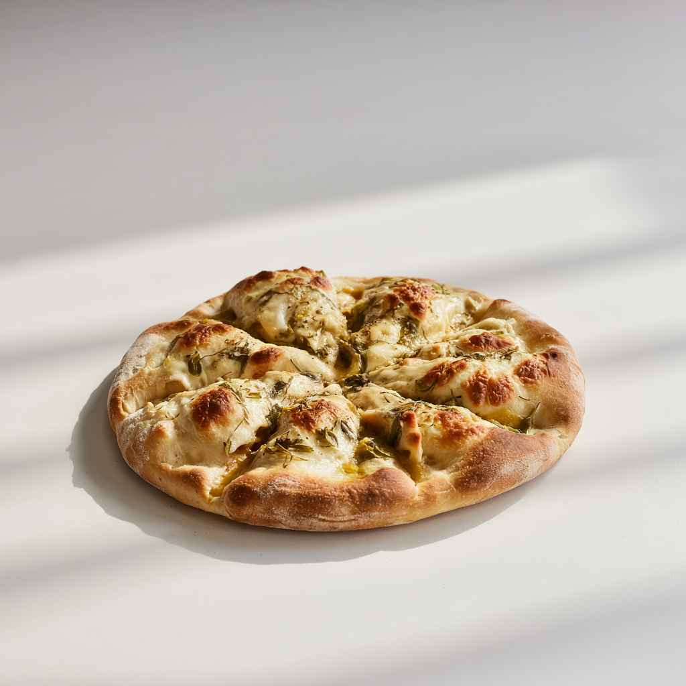

# Zentrum Pizza & Kebab Haus – Website Dokumentation

## Inhalt
- [Allgemeines](#allgemeines)
- [Preise ändern](#preise-ändern)
- [Extras ändern oder hinzufügen](#extras-ändern-oder-hinzufügen)
- [Neue Gerichte/Abschnitte hinzufügen](#neue-gerichteabschnitte-hinzufügen)
- [Bilder einfügen und zuordnen](#bilder-einfügen-und-zuordnen)
- [Tipps für weitere Anpassungen](#tipps-für-weitere-anpassungen)

---

## Allgemeines
Die Website ist eine statische HTML-Seite. Änderungen werden direkt in den HTML-Dateien vorgenommen. Die wichtigsten Dateien sind:
- `menu.html` (Speisekarte)
- `css/custom.css` (eigene Styles)
- `img/` (Bilder-Ordner)

Für alle Änderungen empfiehlt es sich, ein Backup der Dateien zu machen!

---

## Preise ändern
1. Öffne die Datei `menu.html` mit einem Texteditor (z.B. VS Code, Notepad++).
2. Suche das Gericht, dessen Preis du ändern möchtest (z.B. mit STRG+F nach dem Namen suchen).
3. Ändere den Preis im entsprechenden `<span class="text-primary">...€</span>`-Tag.
   
**Beispiel:**
```html
<span>Cola</span>
<span class="text-primary">2,50€</span>
```

---

## Extras ändern oder hinzufügen
1. Extras stehen meist in einem `<small class="fst-italic">Extras: ...</small>`-Tag direkt beim jeweiligen Gericht.
2. Um einen Extra-Text zu ändern oder neue Extras hinzuzufügen, passe diesen Text an.
   
**Beispiel:**
```html
<small class="fst-italic">Extras: Extra Fleisch (+1,00€), Extra Tomaten (+0,50€)</small>
```

---

## Neue Gerichte/Abschnitte hinzufügen
1. Suche in `menu.html` den Bereich (Tab), wo das neue Gericht erscheinen soll (z.B. Getränke, Pide, Seele, etc.).
2. Kopiere einen bestehenden Block (meist `<div class="col-lg-6">...</div>`) und füge ihn an gewünschter Stelle ein.
3. Passe Namen, Preis und Extras an.
4. Für einen neuen Abschnitt kopiere ggf. einen kompletten Tab-Block (`<div id="tab-x" ...>...</div>`) und passe die Navigation entsprechend an (`<li class="nav-item">...`).

---

## Bilder einfügen und zuordnen
1. Lege dein Bild im Ordner `img/` ab.
2. Benenne das Bild möglichst wie die anderen (z.B. `menu-pizza-1.jpg`, `menu-drink-4.jpg`, `menu-seele-2.jpg` usw.).
3. Im jeweiligen Gericht-Block in `menu.html` passe den Bildpfad im `src`-Attribut an:
   
```html

```
4. Das Bild erscheint dann automatisch beim jeweiligen Gericht.

**Hinweis:**
- Die Bilder sollten quadratisch oder im Querformat sein und eine Größe von ca. 300x300px bis 500x500px haben.
- Für neue Kategorien empfiehlt sich ein eigenes Namensschema (z.B. `menu-seele-3.jpg`).

---

## Tipps für weitere Anpassungen
- Die Farben und das Layout kannst du in `css/custom.css` anpassen.
- Für neue Tabs (Menü-Kategorien) muss sowohl im `<ul class="nav ...">`-Bereich als auch im `<div class="tab-content">` ein neuer Block ergänzt werden.
- Für neue Extras oder spezielle Wünsche kannst du das HTML flexibel erweitern.
- Die Kontakt- und Footer-Daten findest du ganz unten in `menu.html` und `index.html`.

---

## Kontakt für Rückfragen
Belkis Aslani  
Freiberuflicher Web/Medien Designer  
E-Mail: belkis.aslani@gmail.com  
Tel: 0176 81462526

---

**Viel Erfolg beim Anpassen deiner Speisekarte!**
